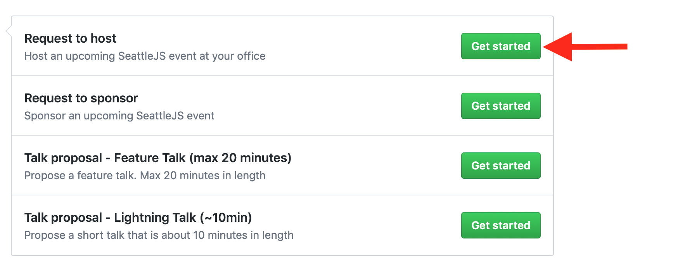

# Hosting SeattleJS

SeattleJS often relies on local Seattle tech companies to act as a host for our events. It's an excellent opportunity to engage with some of the brightest web developers in Seattle and give back to the developer community.

In order to be a host, you must be able to provide:

* Seating for 150+
* Good and accessible Wi-Fi
* Ability to project (audio input also helps)

We ask that the room is set up by 6pm on the night of the meetup. Our organizers will arrive between 5:30 and 6 to help get things set-up and assist with any logistics that need handling.

You can check out our Meetup page and see which of our upcoming meetups does not currently have a venue. If you're interested in hosting, just follow these directions.

## Submitting a Hosting Request

We use Github issues to manage requests to host. Just click on the issues icon on the sidebar to get started:

Next, click the "New Issue" button:

Lastly, select the Request to host templand, fill-in the form, and submit. We will be in contact soon!

