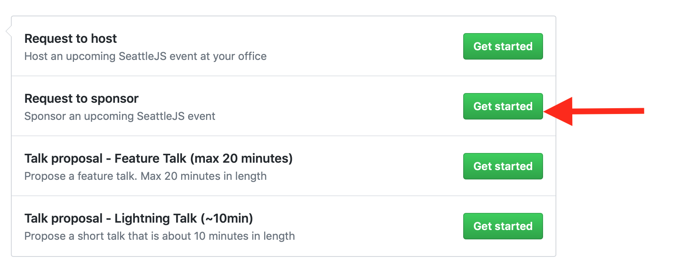

# Sponsoring SeattleJS

SeattleJS could not exist without the support of the community, and this includes companies who understand the importance of investing in the local developer community. Improving the quality of the developer community in and around Seattle means that better products and services are built here and hopefully more companies choose to stay here. As part of sponsorship, sponsors are featured on the sponsor bar of our meetup page and given an opportunity to say a word about their company (great for recruiting!)/

## How You Can Help

SeattleJS meets anywhere from once to twice a month. Our events are free (or near free) for participants and we rely on sponsors to help pay for food and drink. $1500 is a good ballpark, depending on menu and attendance.

## Submitting a Sponsorship Request

We use Github issues to manage requests to sponsor. Just click on the issues icon on the sidebar to get started:

Next, click the "New Issue" button:

Lastly, select the Request to sponsor template, fill in the form and submit. We will be in contact shortly!

